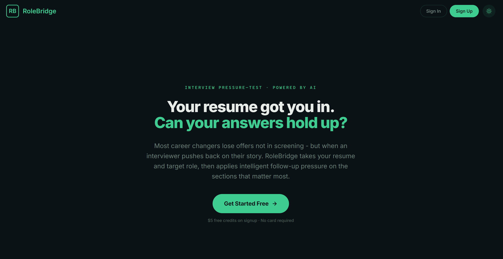
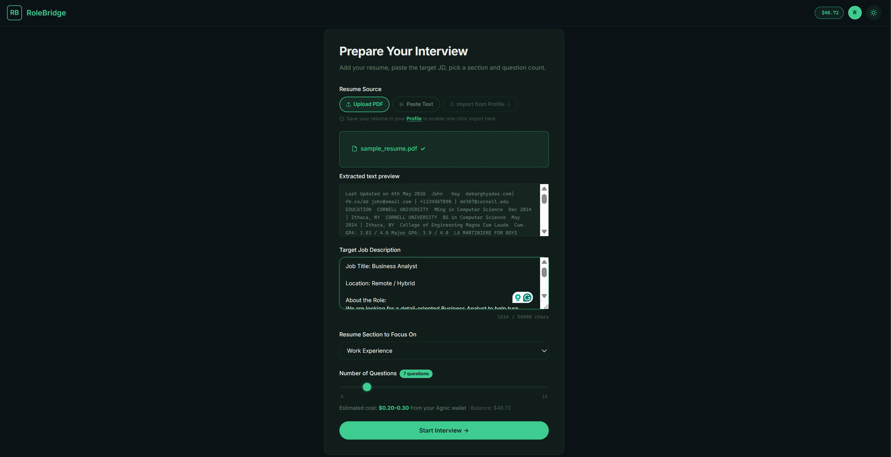
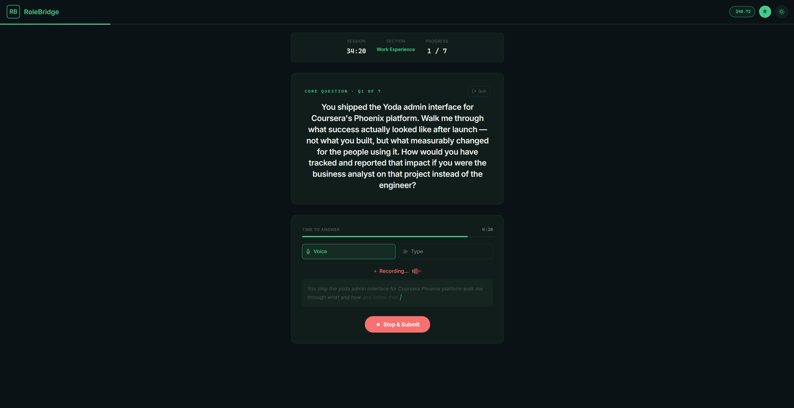
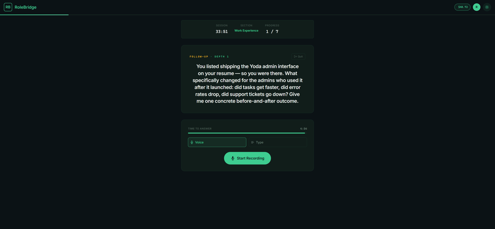
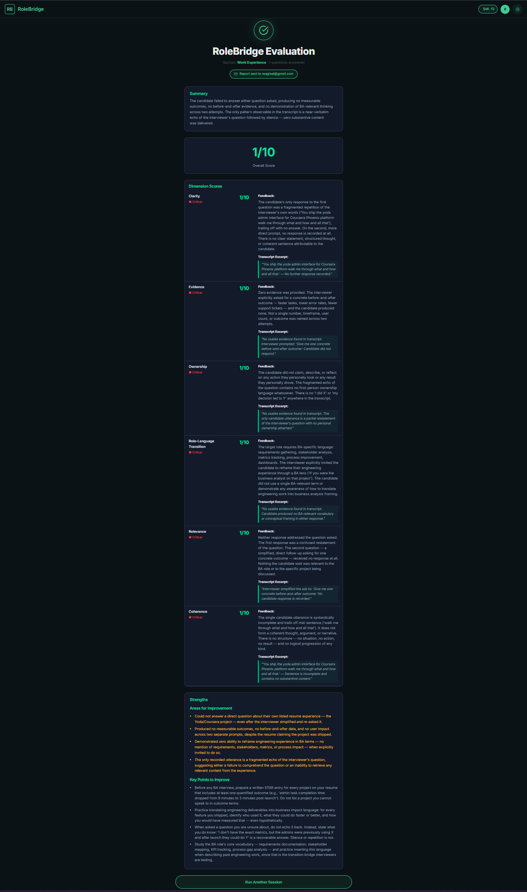

# RoleBridge
Interview Pressure-Test · Powered by AI

**Hackathon:** Agnic Agentic Commerce Pioneers · Track 2 — Monetize Your AI App
**License:** MIT

## Product Overview
RoleBridge is a highly adaptive, role-specific interview simulation platform. It is specifically designed for mid-career professionals transitioning between different roles, functions, or industries. Rather than relying on generic question banks, RoleBridge utilizes the candidate's actual resume and target job description to pinpoint narrative gaps, applying intelligent follow-up pressure exactly where candidates tend to break down in real interviews.

## The Problem & Target Customer
- **The Audience:** Mid-career professionals switching between different roles, functions, or industries.
- **The Core Problem:** Most professionals switching roles between different roles, functions or industries can position themselves well enough on paper to get shortlisted, but break down when interviewers probe deeper - answers become vague, inconsistent, or disconnected from the target role's expectations and candidate loses credibility, confidence as well as the role itself.
- **The Consequence:** Under the pressure of follow-up questions, they revert to old functional language, fail to demonstrate concrete ownership, and ultimately lose the offer due to a weak, disconnected storyline.

## Value Proposition
RoleBridge provides an environment where candidates can safely hit their breaking point. By rigorously pressure-testing answers against the target job description and pushing back on vague claims in real-time, the platform forces candidates to clarify their evidence, translate their adjacent experience under pressure, and walk into the real interview with tested confidence.

## How It Works (Core User Flow)
1. **Upload Your Profile:** Connect via Agnic OAuth. Upload your resume (PDF, paste, or import from profile) and paste your target job description. The AI instantly identifies the gap between your current background and target role.
2. **Setup Session:** Select the specific resume section you want to focus on (e.g., Work Experience, Projects) and choose the intensity (6-15 questions).
3. **The Pressure Test:** Engage in the interview via real-time voice or text. If your answer is weak or lacks evidence, the AI won't let it slide—it pushes back dynamically with targeted follow-up questions, just like a tough hiring manager.
4. **Pay-as-you-go:** Practice comfortably knowing you only pay for exactly what you use via your Agnic wallet. If your credits run out, the interview safely pauses—ensuring you're always in control of your spending without any surprise charges.
5. **Your Final Report:** Upon completion, receive a brutally honest 6-dimension score report (Clarity, Evidence, Ownership, Role-Language, Relevance, Coherence) both on-screen and via email.

## Demo Walkthrough

▶ **[Watch the 3-minute demo on YouTube](https://youtu.be/N_3dasboA9g)**

### 1. Landing Page

*Agnic OAuth integrated landing page with a clear value proposition.*

### 2. Setup & Context Grounding

*Upload your resume and JD to ground the AI in your specific background and target role.*

### 3. The Pressure Test & Agnic Wallet

*Answer via text or Gladia voice. The Agnic wallet integration tracks usage in real-time (top right).*

### 4. Dynamic Pushback

*If your answer is vague, the AI actively pushes back for concrete evidence and outcomes.*

### 5. 6-Dimension Evaluation Report

*Receive a brutally honest breakdown of your performance across 6 key dimensions.*

## The Team
**Ajay** — Solo builder. Background in product operations and AI systems. Built RoleBridge end-to-end in 10 days.

## Monetization Model
- **Agnic OAuth & Wallet:** Users authenticate via Agnic. Their Agnic wallet funds every API call made during the session.
- **Earn-Per-Generate:** Every AI call routed through the Agnic API Gateway includes our `AGNIC_PARTNER_ID`, earning a commission margin on processed tokens via the Agnic Partner Program (Tier 2 — 10% per call).
- **The 402 Paywall:** When credits run out, the Agnic Gateway returns a `402 Payment Required` response. The backend propagates this to the frontend, which surfaces a top-up modal inline — pausing the interview at the highest-intent moment in the session.
- **Unit Economics:** The base model cost is optimized (e.g., using `gpt-4o-mini` and `claude-sonnet-4.6`), allowing users to be charged $0.50–$1.00 per high-intensity session.

## Technical Stack
- **Frontend:** React 19 / Vite SPA, React Router DOM, vanilla CSS, `pdfjs-dist` (client-side PDF parsing).
- **Backend Infrastructure:** Supabase Edge Functions (Deno runtime) handling 20+ specialized microservices.
- **Database:** Supabase PostgreSQL with RLS policies, persisting sessions, transcripts, eval scores, and question states.
- **Authentication:** Agnic OAuth 2.0.
- **AI Gateway:** Agnic API Gateway for dynamic model routing.
- **Voice:** Gladia API for real-time Speech-to-Text via WebSockets.
- **Email:** Resend API for delivering the post-mortem report.
- **Deployment:** Vercel (Frontend) and Supabase (Backend).

## Supabase Edge Functions
RoleBridge relies on a deep backend architecture consisting of 21 specialized Edge Functions:

- `v2-auth-callback`: Exchanges the Agnic OAuth code for a session token.
- `v2-auth-me`: Retrieves the current user's profile and session validity.
- `v2-auth-logout`: Invalidates the user's active session.
- `v2-balance`: Fetches the real-time Agnic wallet balance to drive UI state.
- `v2-profile`: Manages user profile data (e.g. saved resumes).
- `v2-sessions`: Initializes a new interview session record in PostgreSQL.
- `v2-session-setup`: (LLM Call) Extracts resume sections and generates the core interview questions.
- `v2-session-get`: Rehydrates the active session state for the frontend.
- `v2-session-answers`: (LLM Call) The core loop—evaluates the user's answer in real-time and triggers dynamic follow-ups.
- `v2-session-end`: Marks the session as completed and triggers the report worker.
- `v2-report`: Fetches the final evaluation report for on-screen display.
- `v2-report-worker`: (LLM Call) Asynchronously generates the 6-dimension report and emails it via Resend.
- `v2-stt-session`: Generates an authenticated Gladia WebSocket URL for real-time voice input.

## Setup & Running Locally

```bash
# 1. Clone the repository
git clone https://github.com/reagleai/agnic-rolebridge.git
cd agnic-rolebridge

# 2. Install frontend dependencies
cd frontend && npm install

# 3. Configure environment variables
cp .env.example .env.local
# Fill in your keys: AGNIC_CLIENT_ID, AGNIC_CLIENT_SECRET, AGNIC_PARTNER_ID,
# GLADIA_API_KEY, RESEND_API_KEY, SUPABASE_URL, SUPABASE_SERVICE_ROLE_KEY

# 4. Run the frontend dev server
npm run dev

# 5. Run Supabase edge functions locally (separate terminal)
cd ../supabase && supabase functions serve
```

> **Note:** Production secrets are managed via the Supabase Vault. Ensure `AGNIC_PARTNER_ID` is set to receive token commissions.

## What's Working, What's Not, What's Next

**What's working:**
- Full end-to-end flow: Agnic OAuth → resume + JD upload → AI question generation → adaptive follow-up loop (voice + text) → 6-dimension report → email delivery.
- Agnic Partner ID commission accrual is live on every AI call. Wallet balance is displayed in real-time and 402 balance depletion is handled inline with a top-up modal.

**What's not:**
- The session resume-after-topup flow (restarting from where the session paused mid-interview after a user tops up) is partially implemented but not fully tested end-to-end in production.
- Voice input (Gladia STT) works but has occasional WebSocket connection drops on slow networks.

**What's next:**
- Persist session transcripts behind login so users return for a second round (currently deleted after report generation).
- Add the "Recruiter's Roast" premium mode — a higher-intelligence model playing a deeply skeptical hiring manager specifically targeting the career-switch story.
- Lock "Ideal Answer Scripts" (corrected answer suggestions) behind a small additional credit spend to add a second monetization layer.

## Live Demo & Repository
- **Live Demo:** [https://agnic-rolebridge.vercel.app/](https://agnic-rolebridge.vercel.app/)
- **Demo Video:** [https://youtu.be/N_3dasboA9g](https://youtu.be/N_3dasboA9g)
- **Repository:** [https://github.com/reagleai/agnic-rolebridge](https://github.com/reagleai/agnic-rolebridge)
